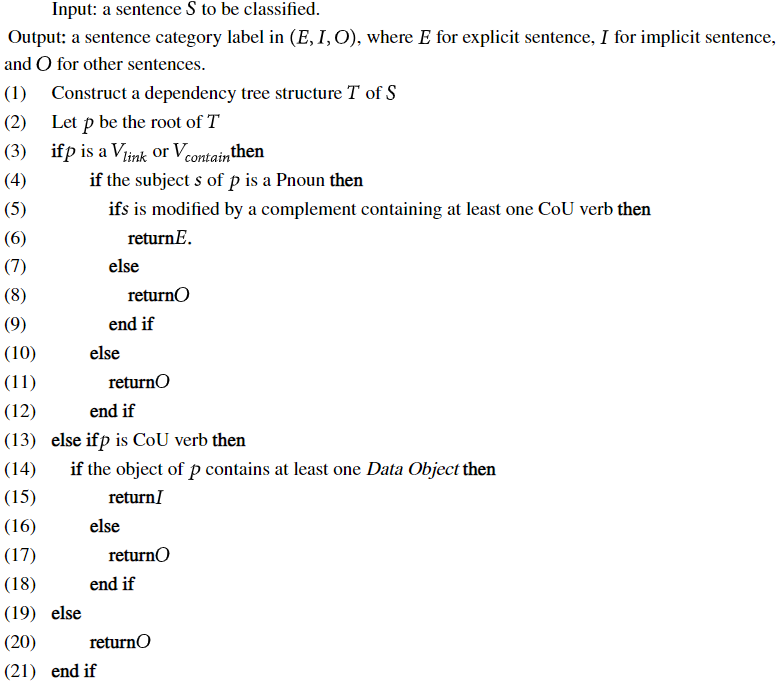

# pur_ext: PurExt Implementation
**Author:** Vincent Miller \
**Date:** 18 July 2022 \
**Files:** main.py, functions.py, policy_totals.csv, README.txt  
\ **Folders:** Extracted Policies, Plain Text Policies

## `main.py`

In order to run main.py, plain text policies must be in the Plain Text Policies
folder and saved as .txt file type. This code allows for multiprocessing which
is controlled by a boolean variable that is defaulted to True. This code defaults
to 8 processes which can be controlled by the user. The files_all will be split
according to how many processes there are, so each process gets an equal amount
of files to policies. There are performance timers so the user may track how long
each policy takes and how long the overall process takes.

## `functions.py`

This file contains necessary functions to complete the Purpose Extraction
implementation. 

* `is_complete()`: Checks for complete sentences. 
* `custom_sentence_end()`: Adds to the spacy pipeline for the inclusion of newlines at the end of sentences.
* `rule_extractor()`: Does the bulk of the heavy lifting. It applies the pseduocode provided by the PurExt authors and returns a pandas dataframe.
* `process_policies()`: Calls the rule_extractor() while using performance timers to keep track of how long each policy takes. This also exports each dataframe to a csv file saved in the folder "Extracted Policies."
* `generate_totals()`: Creates policy_totals.csv which contains the totals for "Policy", "Total Sentences", "Total Words", "Total Explicit", "Total Implicit", "Total Other", "Total Actions", "Total Data Objects", "Total Purposes."

## PurExt Reference:

Lu Yang, Xingshu Chen, Yonggang Luo, Xiao Lan, Li Chen, 
"PurExt: Automated Extraction of the Purpose-Aware Rule from the Natural 
Language Privacy Policy in IoT", Security and Communication Networks, 
vol. 2021, Article ID 5552501, 11 pages, 2021. 
https://doi.org/10.1155/2021/5552501

## PurExt Algorithm, SentenceClassification() Pseudocode

  

## Word Lists
    Verb_CoU = Access, check, collect, disclose, gather, keep, know, obtain, process, provide, receive, request, retain, save, share, store, transfer, update, use, utilize
  
    Pnoun = Purpose, reason, intention, goal, motivation, way
